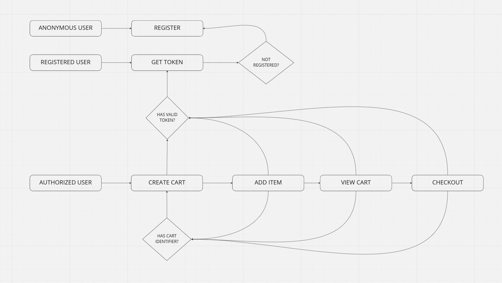

# backend-cart-api

<hr>

## Installation

```
composer update
```

Create the `.env` file with your database credentials before running the following commands (see `.env.example` file):

```
php artisan key:generate
php artisan migrate
```

Now you should be good to go! :)

<hr>

## Testing

**Note:** To be able to run the tests, make sure you created the test database with the same name as defined in the `phpunit.xml` file. Use the following command to run the tests:

```
php artisan test
```

## API Documentation

### OpenAPI

After you configured the application, and it is up and running, you can access the API specification on the `/api/documentation` path.

### Postman

The Postman collection can be found on the same repository inside de folder `postman`.

- The collection is configured to get the _{{BASE_URL}}_ from the Postman Environment.
- There are public and restricted endpoints. The first step is to register a user and issue an API token.
- After you obtain an API token, click on the _restricted_ folder and put the token under authorization (bearer token). The restricted endpoints will inherit the authorization from the parent folder.

## System Overview



## Contributors

- **[André Cardoso](https://github.com/alcsousa)**
